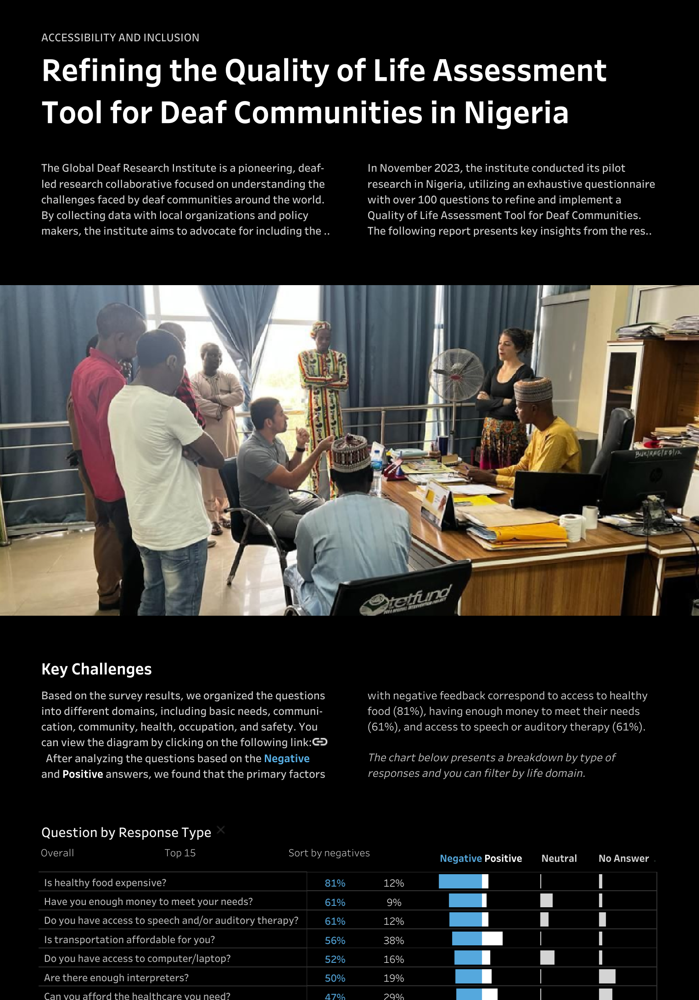
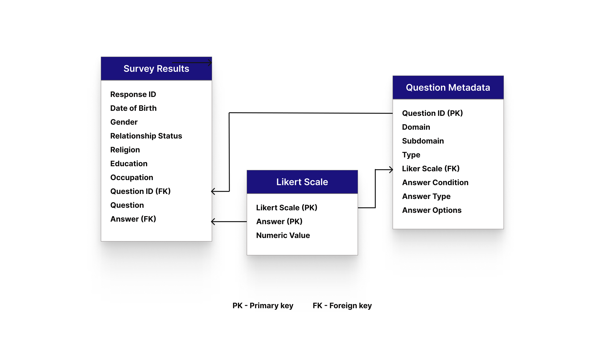
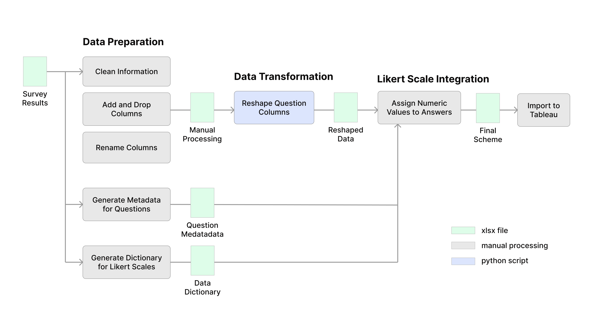
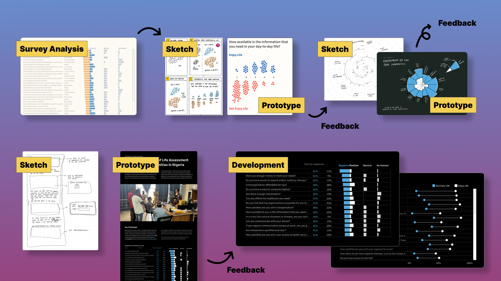

# Refining the Quality of Life Assessment Tool for Deaf Communities in Nigeria

Welcome to the Deaf Community Project repository. This project aims to identify and address the most pressing challenges faced by Deaf communities and improve collaboration and coordination among deaf organizations to maximize impact and resources.

## Summary
The Global Deaf Research Institute is a pioneering, deaf-led research collaborative focused on understanding the challenges faced by deaf communities worldwide. By collecting data with local organizations and policymakers, the institute aims to advocate for including the deaf experience in public health policy. 

In November 2023, the institute conducted its pilot research in Nigeria, utilizing an exhaustive questionnaire with over 100 questions to refine and implement a Quality of Life Assessment Tool for Deaf Communities. The following report presents key insights from the research. This project aims to help the Global Deaf Research Institute (GDRI) communicate the findings effectively to deaf organizations and prioritize strategies. It also includes recommendations for future surveys. You can visit the dashboard at the following [link.](https://public.tableau.com/app/profile/munozdataviz/viz/DeafCommunitySurveyNigeria/Report)

## Data Model
The project utilizes survey data from 231 deaf individuals in Nigeria, featuring over 100 questions across various life domains. These domains include basic needs, communication, community, health, occupation, and safety. The dataset also includes metadata about the questions and the Likert scales used. You can access the production dataset using the following [link](data/)

## Pipeline
The analysis pipeline consists of several stages:

- **Data Acquisition:** Survey results data were obtained from the VizForSocialGood project [link.](https://www.vizforsocialgood.com/join-a-project/2024/global-deaf-research-institute), shared by the Global Deaf Research Institute.
- **Data Preparation:** The dataset was cleaned, and demographic fields were renamed.
- **Data Transformation:** The table's structure was reshaped, with all questions moved from single columns to individual columns, and corresponding answers placed in separate columns. You can access the script in the following [link](scripts/reshape_data.py).
- **Likert Scale Integration:** Numeric values were assigned to the Likert scale answers.
- **Dashboard Design:** The dashboard was developed using Tableau Public.

## Dashboard Design Process
The design of the interactive dashboards follows a structured process:

- **Requirements Gathering:** Stakeholder requirements were gathered to understand their needs and objectives.
- **Sketching:** Initial concepts were sketched to visualize the layout and functionality of the final visualization.
- **Design Iteration:** The design was iterated based on feedback from stakeholders, refining the layout, visual elements, and interactivity.
- **Development:** Once the design was finalized, the report was developed using Tableau Public, implementing the necessary visualizations and interactive features.

## Repository Structure
- **data/:** Contains the raw and processed data used in the analysis.
- **scripts/:** Includes Python scripts for data preparation.
- **visualization/:** Contains screenshots of all the steps in the design process.
- **diagrams/:** Image files used in the README and documentation.
